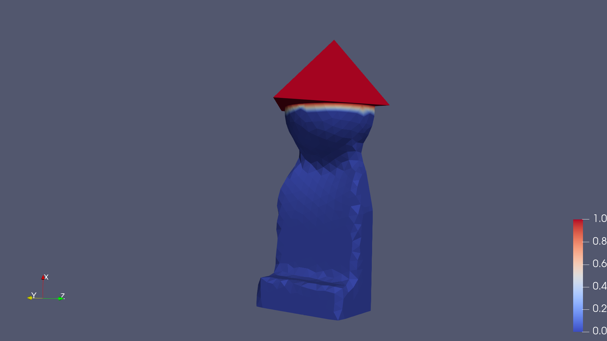
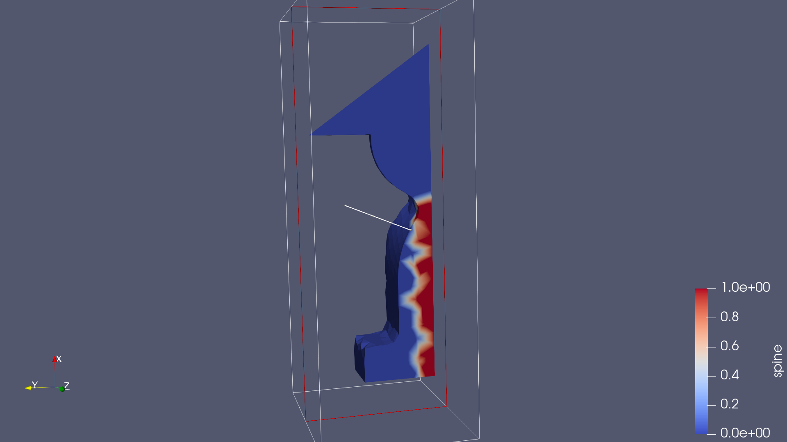
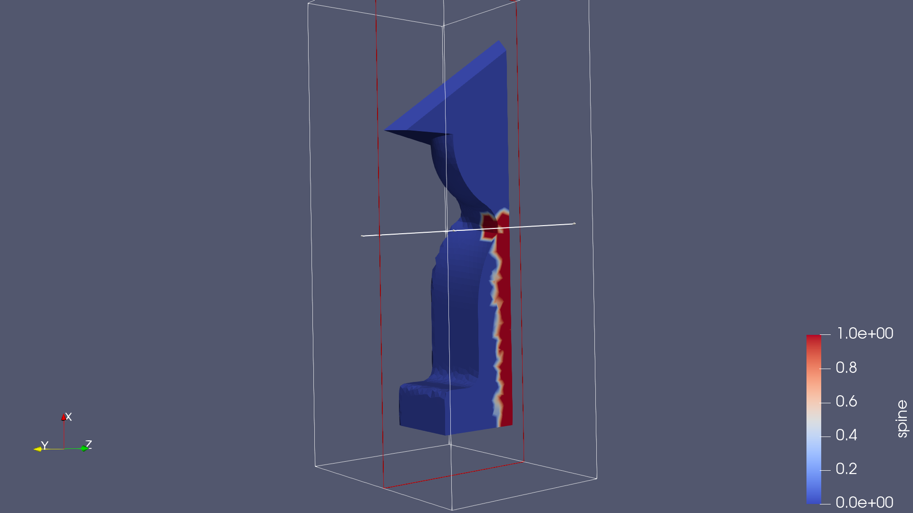
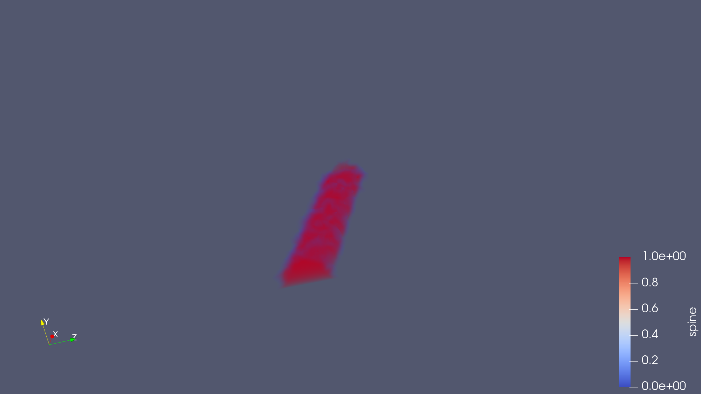

### Лаба 2: VTK

#### Что касается скалярных полей

Здесь будут картинки а не видео, потому что скалярные величины не меняются с течением времени.

Не то чтобы поля имеют какой-то особенный смысл, скорее способ раскрасить алеута. Как несложно заметить, у него есть шапка. Выделим её красным цветом (ну или цветом в целом):

Ещё у алеута есть позвоночик. В идеале он должен представлять из себя что-то вроде цилиндра с такой параметризацией, но:

Конечно проблема в сетке. Сложно составить идеальный цилиндр из тетраэдров, которые даже под цилиндр не подгоняются. Если увеличить мелкость сетки, будет выглядеть посиматичней:

А если смотреть в режиме `volume` то вообще даже ничего:

#### Что касается векторных полей

На [видео](https://youtu.be/qgb1jR-ExYU) посмотреть, как алеут глядит сначала влево, потом вправо и наконец кивает головой. Смотреть по стороням ему не очень легко, потому что сзади он довольно плоский, но с киванием справляется отменно.